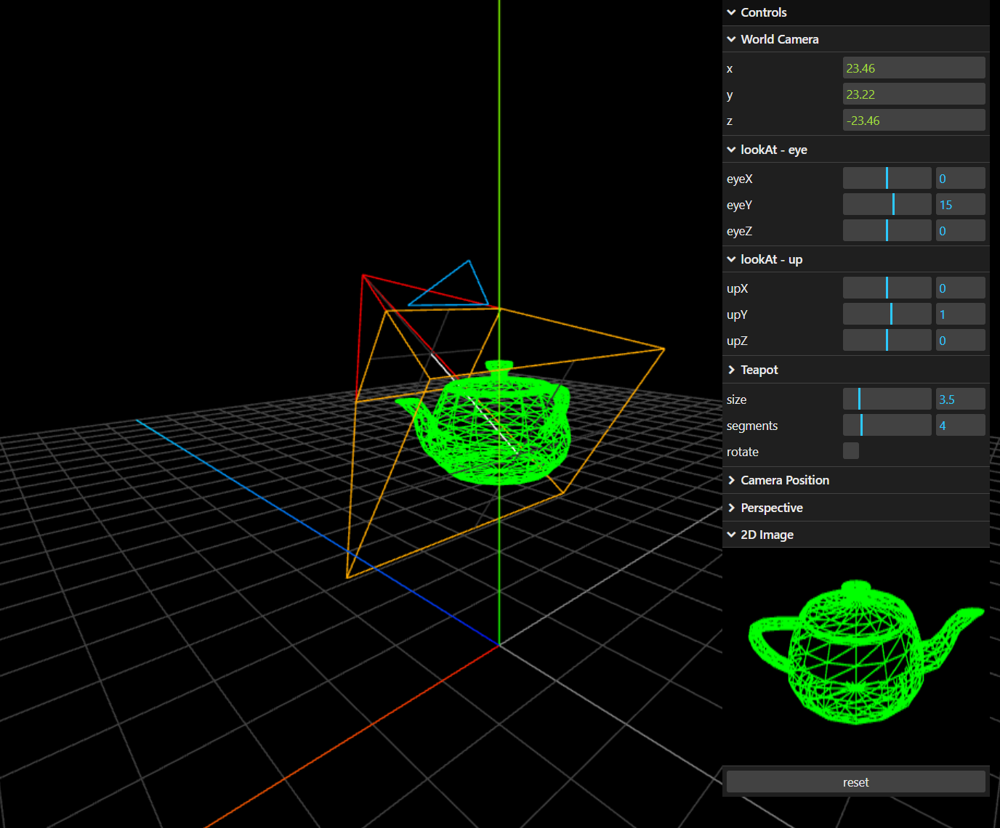

# Viewcamera

The demo scene contains a wireframe teapot mesh with a view camera targeted at it.

The controls allow you to reposition both the lookAt camera and the teapot,
visualizing the different coordinate systems involved in rendering the 3D world
versus producing the final 2D image.

As this is a self‑contained scene observing itself,
it resonates nicely with the spirit of Gödel, Escher, Bach.